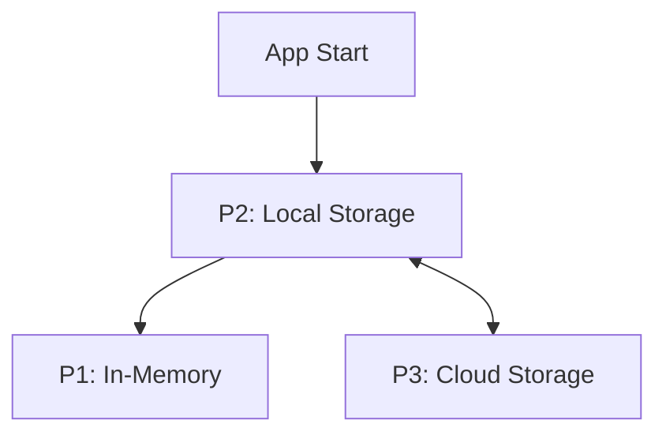
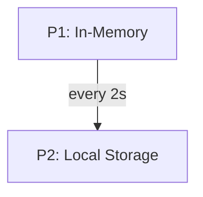
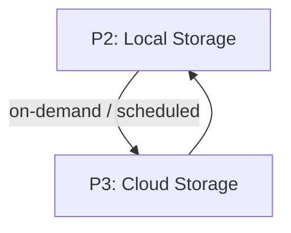
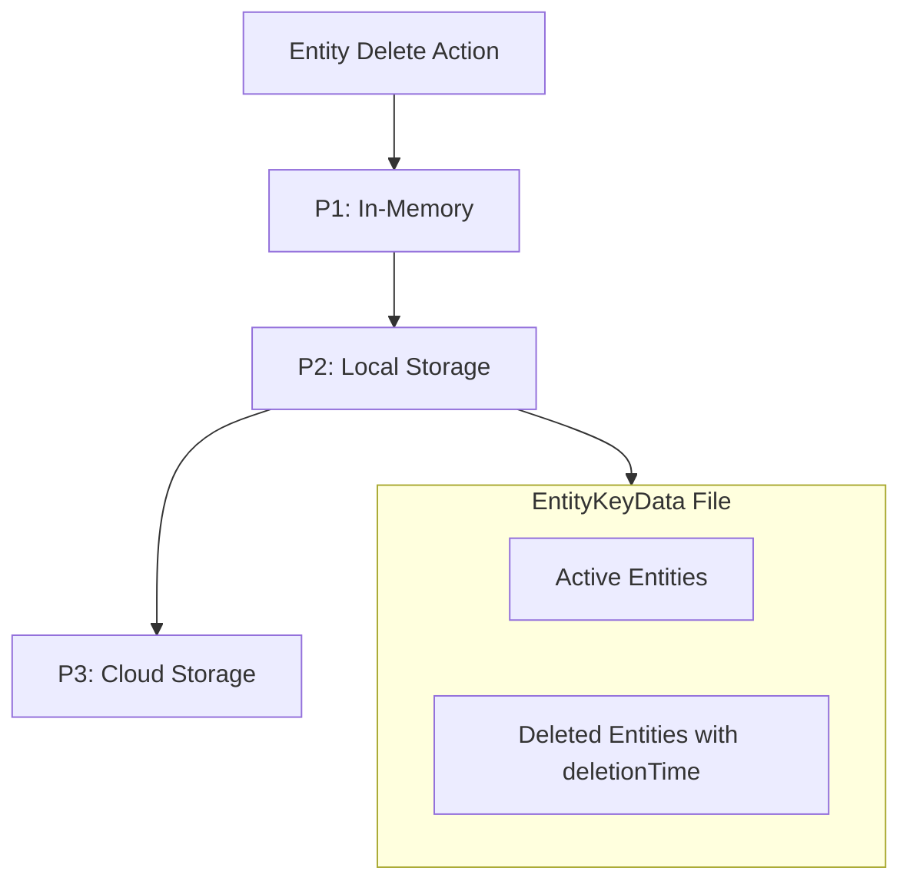

# Entity Sync System

## Overview

Synchronizes entities between multiple persistence layers (memory, local storage, cloud) with robust conflict resolution and safe deletes. Supports both automatic and user-triggered syncs.

---

## Persistence Layers

- **P1: In-Memory** – Fast, ephemeral, cleared on restart.
- **P2: Local Storage** – Reliable, offline, periodically synced from memory.
- **P3: Cloud Storage** – Optional, for cross-device sync and backup.

---

## Entity Structure

- **Entity**: Has `id`, `version`, `updatedAt`.
- **EntityKey**: Groups entities by scope (global, yearly, monthly).
- **EntityKeyData**: Stores all entities and deleted markers for a given key.

---

## Metadata

- Tracks last update time, per-key hashes, and entity counts.
- Used for fast dirty checks and sync decisions.

---

## SyncHandler

`SyncHandler` is the core class for synchronizing two persistence layers:

- Compares metadata to detect changes.
- Identifies missing or changed entity keys.
- Resolves differences at the entity level using version and updatedAt.
- Handles safe deletes and updates.
- Ensures atomic writes and stable ordering.
- Only one sync runs at a time per pair.

**Conflict Resolution:**
- Update vs Update: Higher version wins.
- Update vs Delete: Compare version and deletion time.
- Delete vs Delete: Latest deletion time wins.
- Missing vs Present: Treat as new entity.

---

## SyncScheduler

`SyncScheduler` manages sync jobs and ensures only one sync runs at a time:

- Maintains a queue of sync requests.
- Deduplicates requests for the same source/target pair.
- Supports both fire-and-forget (`triggerSync`) and awaitable (`sync`) syncs.
- Automatically processes the next job when the current one finishes.
- Periodic syncs can be scheduled externally.

**Usage Example:**
```ts
const scheduler = new SyncScheduler("prefix");
scheduler.triggerSync(persistenceA, persistenceB); // fire-and-forget
await scheduler.sync(persistenceA, persistenceB);  // wait for completion
```

---

## Data Flow

- On app start: Load local storage, sync with cloud, populate memory.
- Periodic: Flush memory to local storage.
- On demand: Sync local storage with cloud.
- Deletes: Mark entities as deleted with timestamp, propagate deletes.

---

## Design Goals

- Fast sync checks via metadata.
- Precise, scalable entity-level resolution.
- Safe deletes and conflict handling.
- Minimal overhead for large datasets.

---

**See `SyncHandler.ts` and `SyncScheduler.ts` for implementation details.**
* Example:

  * Global config → `app.global`
  * Yearly data → `app.2025`
  * Monthly data → `app.2025.05`

### 2.3 EntityKey File

* Each key corresponds to one file/object in storage.
* Stores all entities of that scope.
* Contains both **active entities** and **deleted entities**.

---

## 3. Storage File Structure

### 3.1 EntityKeyData

[EntityKeyData.ts](./interfaces/EntityKeyData.ts)

* Stores entities under their `entityName` and `id`.
* Deleted entities tracked separately:

```ts
{
  [entityName: string]: {
    [id: string]: Entity
  },
  deleted: {
    [entityName: string]: {
      [id: string]: Date // deletionTime
    }
  }
}
```

---

### 3.2 Metadata

[Metadata.ts](./entities/Metadata.ts)

* Lightweight index for quick sync checks.
* Contains:

  * `updatedAt` – last updated timestamp.
  * For each `entityKey`:

    * `updatedAt`
    * `hash` (file-level hash, dirty check only)
    * Per-entityName stats: `count`, `deletedCount`

---

## 4. Data Lifecycle Scenarios

1. **App Start**

   * Load P2 (local storage).
   * Sync P2 ↔ P3 (cloud).
   * Populate P1 (memory).



2. **Periodic Save (every \~2s)**

   * Flush P1 → P2.



3. **Cloud Sync (manual / interval / setting-based)**

   * Sync P2 ↔ P3.



4. **Entity Delete**

   * Remove entity from active set in `EntityKeyData`.
   * Add entry in `deleted[entityName][id]` with `deletionTime`.
   * Metadata updated with new `deletedCount`.




---

## 5. Design Goals

* **Fast checks** via metadata (`hash`, `counts`).
* **Precise resolution** via entity-level comparison.
* **Safe deletes** with `deletionTime` rules.
* **Minimal overhead** → only hashes and counts in metadata, not per-entity details.
* **Scalable** → works for thousands of entities per file without linear scans on every sync.


## Sync Algorithm

The sync process is defined as `sync(Pa, Pb)` where Pa and Pb are two persistence layers (e.g., memory ↔ local storage, local ↔ cloud). Only one sync runs at a time.

### Guardrails

* **Single sync at a time** → no parallel runs.
* **Per-instance `version`** → deterministic conflict resolution.
* **Deleted entities tracked inside `EntityKeyData`** (not metadata).
* **Metadata is lightweight** → quick dirty checks, not detailed tracking.
* **Stable entity ordering on save** → avoids false hash mismatches.
* **Atomic writes** where supported.

### Steps

#### 1. Metadata Comparison

1. Compare `Metadata.updatedAt` of Pa and Pb.

   * If equal → exit (no changes).
2. Store Pa’s `updatedAt` in variable `t1`.
3. Identify all **entity keys** whose `hash` values differ.

   * If none differ → exit.
4. Create a temporary **bucket b1** to hold entities that need to flow back to Pa later.

---

#### 2. Entity Key Comparison

For each entity key:

1. **Key exists in both Pa and Pb** →

   * Compare `hash` values.
   * If different → proceed to entity-level resolution.

2. **Key exists only in Pa (new file)** →

   * Copy the entire `EntityKeyData` file from Pa → Pb.
   * Update Pb’s metadata with the new key, counts, and hash.
   * Add affected entities into bucket `b1` (so they can be considered for backflow if Pa changed during sync).

3. **Key exists only in Pb (new file)** →

   * Symmetric case.
   * Copy file from Pb → Pa.
   * Update Pa’s metadata accordingly.
   * No need to add to bucket `b1` since Pb is already being updated from Pa.

---

#### 3. Entity-Level Resolution

For each entity `id` under a given `entityName`:

* **Case A: Both active**

  * Compare `version`.
  * Higher `version` wins.
  * If equal → compare `updatedAt`.

* **Case B: One active, one deleted**

  * Compare entity’s `version` with the deletion’s `deletionTime`.
  * If `deletionTime > version` → delete wins (remove from active set, record in `deleted`).
  * Otherwise → keep entity, ignore deletion.

* **Case C: Both deleted**

  * Keep the latest `deletionTime`.
  * Ensure both sides have consistent delete markers.

* **Case D: Only on one side (new entity)**

  * Copy entity to the other side.
  * Ensure `version` increments appropriately.

Any entity updates that must flow back into Pa (because Pb had the fresher data) are added into **bucket b1**.

---

#### 4. Persist Updates

1. Save updated entity key file `Kb`.
2. Update `Pb.metadata` with the new hash and counts from Pa.

---

#### 5. Two-Way Consistency Check

1. Reload `Pa.metadata`.
2. If Pa’s `updatedAt == t1` → safe to apply bucket `b1` into Pa.
3. If Pa’s `updatedAt != t1` → Pa changed during sync.

   * Re-compare entities in bucket b1 with Pa’s current data.
   * Apply entity-level resolution again (`version` / `updatedAt` rules).
   * Update Pa accordingly.

---

#### 6. Finalize

* Persist all modified files.
* Ensure both Pa and Pb metadata are aligned.

---

## Conflict Resolution Summary

* **Update vs Update** → higher `version` wins.
* **Update vs Delete** → compare `version` vs `deletionTime`.
* **Delete vs Delete** → keep latest `deletionTime`.
* **Missing vs Present** → treat as new entity.

---